<picture><source media="(prefers-color-scheme: dark)" srcset="assets/ce12-name-dark.svg" /></picture>

**SWE Intern @ ASML · Ex-Stellantis · CSE @ TU/e**

[Work](#work) &nbsp; / &nbsp; [Projects](#projects) &nbsp; / &nbsp; [Building](#building) &nbsp; / &nbsp; [erturks.com](https://erturks.com) &nbsp; / &nbsp; [LinkedIn](https://www.linkedin.com/in/canetrk/) &nbsp; / &nbsp; [Email](mailto:canetrkk@gmail.com)

## Work

<picture><source media="(prefers-color-scheme: dark)" srcset="assets/ce12-asml-dark.svg" />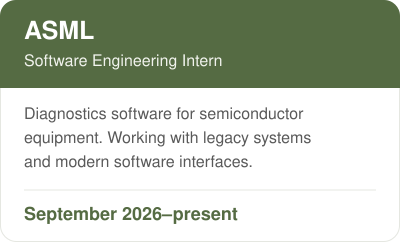</picture>
<picture><source media="(prefers-color-scheme: dark)" srcset="assets/ce12-stellantis-dark.svg" />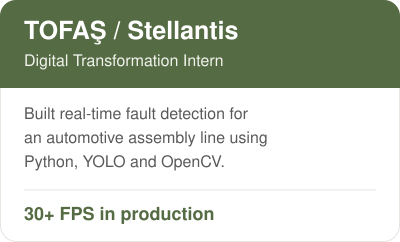</picture>

Software engineering at **ASML**, since September 2026. Previously, built a real-time fault-detection system at **TOFAŞ / Stellantis**, running at **30+ FPS** in production.

### Along the way

<picture><source media="(prefers-color-scheme: dark)" srcset="assets/ce12-age-13-dark.svg" />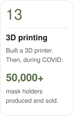</picture>
<picture><source media="(prefers-color-scheme: dark)" srcset="assets/ce12-age-16-dark.svg" />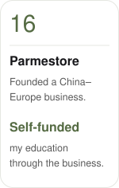</picture>
<picture><source media="(prefers-color-scheme: dark)" srcset="assets/ce12-age-17-dark.svg" />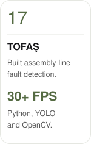</picture>
<picture><source media="(prefers-color-scheme: dark)" srcset="assets/ce12-age-19-dark.svg" />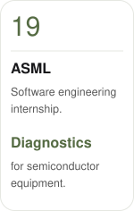</picture>

## Projects

<a href="https://github.com/ErturkCan/Regular_Polygons_Intersection"><picture><source media="(prefers-color-scheme: dark)" srcset="assets/ce12-geometry-dark.svg" />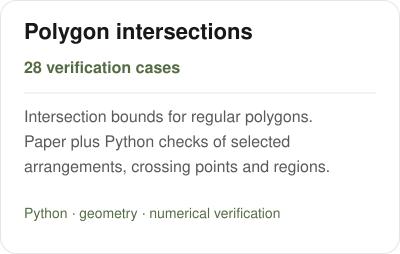</picture></a>
<a href="https://github.com/ErturkCan/assembly-line-cv"><picture><source media="(prefers-color-scheme: dark)" srcset="assets/ce12-vision-dark.svg" /></picture></a>

[Read the polygon paper](https://github.com/ErturkCan/Regular_Polygons_Intersection/blob/main/paper.pdf) · [Run the geometry checks](https://github.com/ErturkCan/Regular_Polygons_Intersection/blob/main/verify.py) · [Computer vision code](https://github.com/ErturkCan/assembly-line-cv)

### More code

<a href="https://github.com/ErturkCan/tue-computer-systems"><picture><source media="(prefers-color-scheme: dark)" srcset="assets/ce12-systems-dark.svg" />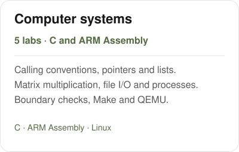</picture></a>
<a href="https://github.com/ErturkCan/parmestore-tools"><picture><source media="(prefers-color-scheme: dark)" srcset="assets/ce12-commerce-dark.svg" />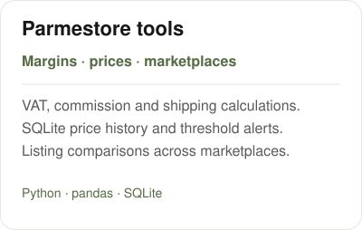</picture></a>
<a href="https://github.com/ErturkCan/melanoma-classifier"><picture><source media="(prefers-color-scheme: dark)" srcset="assets/ce12-ml-dark.svg" />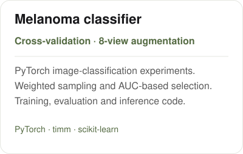</picture></a>
<a href="https://github.com/ErturkCan/supply-chain-analysis"><picture><source media="(prefers-color-scheme: dark)" srcset="assets/ce12-simulation-dark.svg" />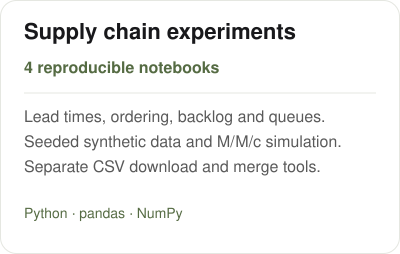</picture></a>

## Stack

**Code** &nbsp; `Python` `C` `ARM Assembly` `TypeScript` `SQL`

**Vision & data** &nbsp; `YOLO` `OpenCV` `PyTorch` `pandas` `NumPy`

**Tools** &nbsp; `Linux` `Git` `Make` `QEMU` `SQLite` `Supabase`

## Building

### [stip](https://getstip.com) · digital receipts

NFC receipts for cafés and restaurants. Tap your phone, get your receipt. Currently a prototype.

### Parmestore

I started Parmestore at 16 and paid for my education with the business I built. China–Europe e-commerce; closed in November 2025. Some of the [Python tools](https://github.com/ErturkCan/parmestore-tools) are here.

**KickOff** · Director of Events, Eindhoven’s student entrepreneurship community.

### Before that

Built my first 3D printer at 13, then produced and sold **50,000+ mask holders** during COVID. At 15, launched a **10,000+ piece NFT collection**.

Also · graduate-level data science coursework with **Prof. M. Emre Celebi, UCA** · competitive **orienteering**.

---

Obsessive about systems. Comfortable with chaos. Bad at doing nothing.

I work a lot. I enjoy it. The two being connected is something I consider a personal win.

Drawn to hard environments, sharp people. Still in the first chapter. Already taking notes.
