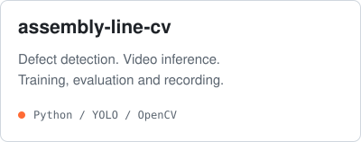
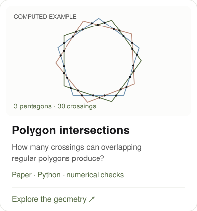
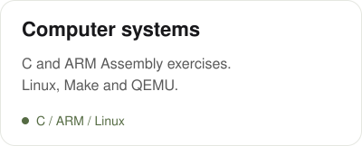
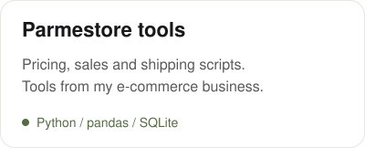
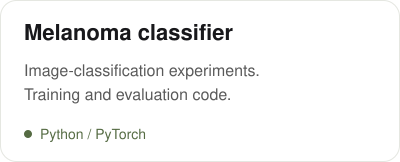
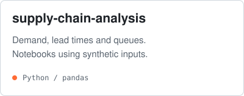

<picture>
  <source media="(prefers-color-scheme: dark)" srcset="assets/name-dark.svg" />
  
</picture>

**SWE Intern @ ASML · CSE @ TU/e · Ex-Stellantis**

eindhoven, nl · building [stip](https://getstip.com)

[erturks.com](https://erturks.com) &nbsp; / &nbsp; [linkedin](https://www.linkedin.com/in/canetrk/) &nbsp; / &nbsp; [email](mailto:canetrkk@gmail.com)

---

Obsessive about systems. Comfortable with chaos. Bad at doing nothing.

I work a lot. I enjoy it. The two being connected is something I consider a personal win.

Drawn to hard environments, sharp people. Still in the first chapter. Already taking notes.

## 01 · Building

### [stip](https://getstip.com) · digital receipts

NFC receipts for cafés and restaurants. Tap your phone, get your receipt. Currently a prototype.

At **ASML**, I work on diagnostics software. At **TU/e**, I study Computer Science and Engineering. I'm also **Director of Events at KickOff**.

## 02 · Projects

<a href="https://github.com/ErturkCan/assembly-line-cv"><picture><source media="(prefers-color-scheme: dark)" srcset="assets/vision-dark.svg" /></picture></a>
<a href="https://github.com/ErturkCan/Regular_Polygons_Intersection"><picture><source media="(prefers-color-scheme: dark)" srcset="assets/geometry-dark.svg" /></picture></a>
<a href="https://github.com/ErturkCan/tue-computer-systems"><picture><source media="(prefers-color-scheme: dark)" srcset="assets/systems-dark.svg" /></picture></a>
<a href="https://github.com/ErturkCan/parmestore-tools"><picture><source media="(prefers-color-scheme: dark)" srcset="assets/commerce-dark.svg" /></picture></a>
<a href="https://github.com/ErturkCan/melanoma-classifier"><picture><source media="(prefers-color-scheme: dark)" srcset="assets/ml-dark.svg" /></picture></a>
<a href="https://github.com/ErturkCan/supply-chain-analysis"><picture><source media="(prefers-color-scheme: dark)" srcset="assets/simulation-dark.svg" /></picture></a>

## 03 · Track record

`13` · Built a 3D printer. During COVID, produced **50,000+ mask holders**.

`15` · Launched a **10,000+ piece NFT collection**.

`16` · Founded **Parmestore International**. China–Europe e-commerce; closed in November 2025.

`17` · Computer vision at **TOFAŞ / Stellantis**. Python, YOLO and OpenCV for real-time fault detection.

Also · graduate-level data science coursework with **Prof. M. Emre Celebi, UCA** · competitive **orienteering**.

## 04 · Stack

**Code** &nbsp; `Python` `C` `ARM Assembly` `TypeScript` `SQL`

**Vision & data** &nbsp; `YOLO` `OpenCV` `PyTorch` `pandas` `NumPy`

**Tools** &nbsp; `Linux` `Git` `Make` `QEMU` `SQLite` `Supabase`
