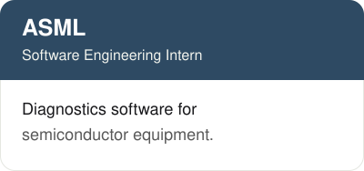
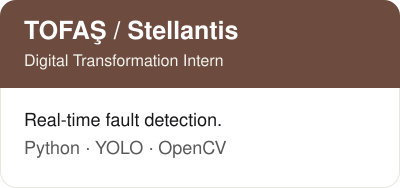
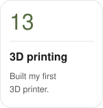
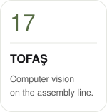
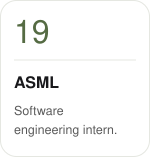
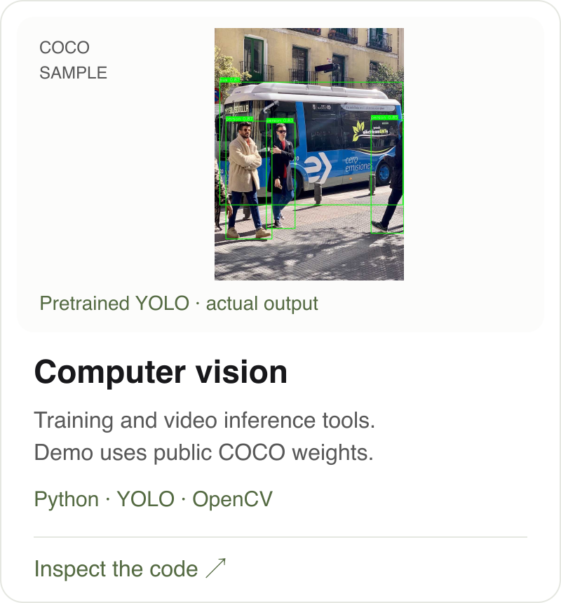
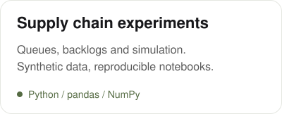

<picture><source media="(prefers-color-scheme: dark)" srcset="assets/ce-name-dark.svg" /></picture>

**SWE Intern @ ASML · Ex-Stellantis · CSE @ TU/e**

[Work](#work) &nbsp; / &nbsp; [Projects](#projects) &nbsp; / &nbsp; [Building](#building) &nbsp; / &nbsp; [erturks.com](https://erturks.com) &nbsp; / &nbsp; [LinkedIn](https://www.linkedin.com/in/canetrk/) &nbsp; / &nbsp; [Email](mailto:canetrkk@gmail.com)

## Work

<picture><source media="(prefers-color-scheme: dark)" srcset="assets/ce-asml-dark.svg" /></picture>
<picture><source media="(prefers-color-scheme: dark)" srcset="assets/ce-stellantis-dark.svg" /></picture>

Software engineering at **ASML**, since September 2026. Previously, computer vision at **TOFAŞ / Stellantis**.

### Along the way

<picture><source media="(prefers-color-scheme: dark)" srcset="assets/ce-age-13-dark.svg" /></picture>
<picture><source media="(prefers-color-scheme: dark)" srcset="assets/ce-age-16-dark.svg" /></picture>
<picture><source media="(prefers-color-scheme: dark)" srcset="assets/ce-age-17-dark.svg" /></picture>
<picture><source media="(prefers-color-scheme: dark)" srcset="assets/ce-age-19-dark.svg" /></picture>

## Projects

<a href="https://github.com/ErturkCan/Regular_Polygons_Intersection"><picture><source media="(prefers-color-scheme: dark)" srcset="assets/ce-geometry-dark.svg" /></picture></a>
<a href="https://github.com/ErturkCan/assembly-line-cv"><picture><source media="(prefers-color-scheme: dark)" srcset="assets/ce-vision-dark.png" /></picture></a>

**Polygon intersections** · A mathematical question explored through a paper and numerical checks. The preview comes from the repository’s own geometry functions. [Paper](https://github.com/ErturkCan/Regular_Polygons_Intersection/blob/main/paper.pdf) · [Reproduce the figure](https://github.com/ErturkCan/Regular_Polygons_Intersection/blob/main/demo.py)

**Computer vision** · Training, video inference and annotations with YOLO/OpenCV. The preview is a public COCO sample; custom defect weights and production data are not in this repository. [Reproduce the demo](https://github.com/ErturkCan/assembly-line-cv/blob/main/demo.py)

### More code

<a href="https://github.com/ErturkCan/tue-computer-systems"><picture><source media="(prefers-color-scheme: dark)" srcset="assets/ce-systems-dark.svg" /></picture></a>
<a href="https://github.com/ErturkCan/parmestore-tools"><picture><source media="(prefers-color-scheme: dark)" srcset="assets/ce-commerce-dark.svg" /></picture></a>
<a href="https://github.com/ErturkCan/melanoma-classifier"><picture><source media="(prefers-color-scheme: dark)" srcset="assets/ce-ml-dark.svg" /></picture></a>
<a href="https://github.com/ErturkCan/supply-chain-analysis"><picture><source media="(prefers-color-scheme: dark)" srcset="assets/ce-simulation-dark.svg" /></picture></a>

## Stack

**Code** &nbsp; `Python` `C` `ARM Assembly` `TypeScript` `SQL`

**Vision & data** &nbsp; `YOLO` `OpenCV` `PyTorch` `pandas` `NumPy`

**Tools** &nbsp; `Linux` `Git` `Make` `QEMU` `SQLite` `Supabase`

## Building

### [stip](https://getstip.com) · digital receipts

NFC receipts for cafés and restaurants. Tap your phone, get your receipt. Currently a prototype.

### Parmestore

I started Parmestore at 16 and paid for my education with the business I built. China–Europe e-commerce; closed in November 2025. Some of the [Python tools](https://github.com/ErturkCan/parmestore-tools) are here.

**KickOff** · Director of Events, Eindhoven’s student entrepreneurship community.

### Before that

During COVID, produced **50,000+ mask holders**. At 15, launched a **10,000+ piece NFT collection**.

Also · graduate-level data science coursework with **Prof. M. Emre Celebi, UCA** · competitive **orienteering**.

---

Obsessive about systems. Comfortable with chaos. Bad at doing nothing.

I work a lot. I enjoy it. The two being connected is something I consider a personal win.

Drawn to hard environments, sharp people. Still in the first chapter. Already taking notes.
