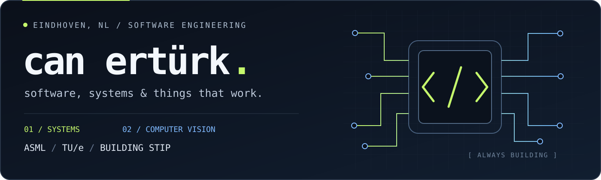
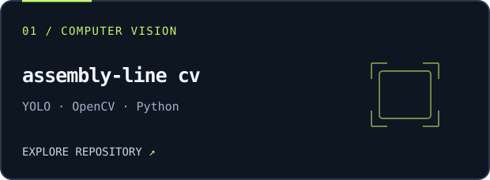
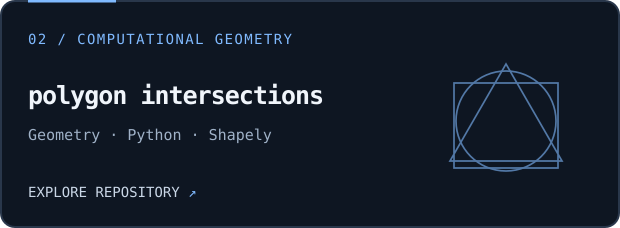
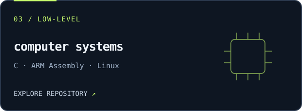
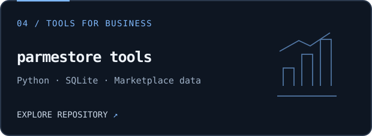
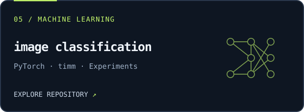
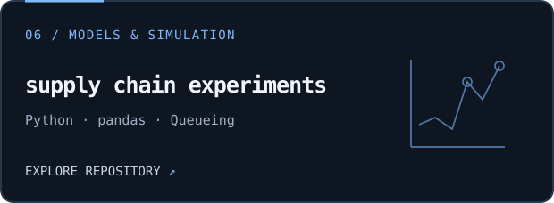

  

  <strong>SWE Intern @ ASML · CSE @ TU/e · Ex-Stellantis</strong> 
  <a href="https://erturks.com">erturks.com</a> &nbsp; / &nbsp;
  <a href="https://www.linkedin.com/in/canetrk/">LinkedIn</a> &nbsp; / &nbsp;
  <a href="mailto:canetrkk@gmail.com">Email</a>

 

> **Obsessive about systems. Comfortable with chaos. Bad at doing nothing.**

I like finding a problem, figuring out what is actually causing it, and building something useful. I've worked on computer vision at TOFAŞ / Stellantis, run an e-commerce business, and now work on diagnostics software at ASML while studying at TU/e.

## 01 &nbsp; / &nbsp; Where I'm putting my energy

| | Work |
| :--- | :--- |
| **ASML** | Software Engineering Intern. Diagnostics software for semiconductor equipment. |
| **TU/e** | BSc Computer Science and Engineering, Eindhoven. |
| **[Stip](https://getstip.com)** | Building an NFC digital receipt prototype for cafés and restaurants. |
| **KickOff** | Director of Events, connecting students with Eindhoven's entrepreneurship community. |

## 02 &nbsp; / &nbsp; Selected work

<table>
<tr>
<td width="50%" valign="top">

Train a defect detector, run it on video, record annotated output and inspect detection logs.

</td>
<td width="50%" valign="top">

A geometry paper with diagrams and numerical checks for crossing points and bounded regions.

</td>
</tr>
<tr>
<td width="50%" valign="top">

Calling conventions, pointers, memory access and processes. Includes ARM test harnesses and QEMU checks.

</td>
<td width="50%" valign="top">

Margin calculations, price history and listing comparisons, shaped by problems I encountered through e-commerce.

</td>
</tr>
<tr>
<td width="50%" valign="top">

Binary image classification with cross-validation, weighted sampling and test-time augmentation.

</td>
<td width="50%" valign="top">

Synthetic models of lead times, ordering and queueing. Exploring how demand and capacity change a system.

</td>
</tr>
</table>

## 03 &nbsp; / &nbsp; What I work with

| Languages | Systems & tools | Data & vision |
| :--- | :--- | :--- |
| `Python` · `C` | `Linux` · `Git` | `PyTorch` · `YOLO` |
| `ARM Assembly` | `Make` · `QEMU` | `OpenCV` · `NumPy` |
| `TypeScript` · `SQL` | `SQLite` · `Supabase` | `pandas` · `scikit-learn` |

## 04 &nbsp; / &nbsp; Before this

- **Built a 3D printer at 13.** During COVID, produced more than **50,000 mask holders**.
- **Founded Parmestore International at 16.** Worked on sourcing and selling products between China and Europe. The business closed in November 2025.
- **Joined TOFAŞ / Stellantis at 17.** Worked on real-time fault detection with Python, YOLO and OpenCV.
- **Studied data science with Prof. M. Emre Celebi at UCA.** Completed graduate-level coursework alongside my earlier studies.

Outside software, I compete in **orienteering**. I also care about the business side of building: finding customers, understanding what they need, and getting something into their hands.

---

  <strong>Based in Eindhoven. Building from here.</strong>  
  <a href="https://erturks.com">More about me ↗</a>

