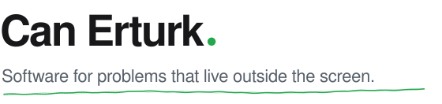
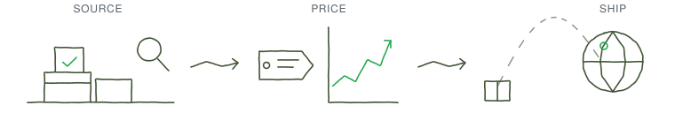
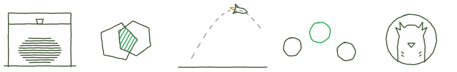

<picture><source media="(prefers-color-scheme: dark)" srcset="assets/doodle-hero-dark.svg" /></picture>

19 · Computer Science & Engineering at TU/e.

## ASML

*Engineers need to see why a machine stopped.*

Software engineering intern since September 2026. Building diagnostic tools in C on Linux and graphical interfaces for semiconductor equipment, connecting legacy systems with modern interfaces.

## Fiat Stellantis

*Spotting faults while the line keeps moving.*

Software Engineering Intern at 17. Built assembly-line fault detection with Python, YOLO and OpenCV, trained on **1,000+ CVAT-annotated images** and running at **30+ FPS in production**, with a **99.9% acceptance-test success rate**.

<picture><source media="(prefers-color-scheme: dark)" srcset="assets/doodle-vision-dark.svg" /></picture>

## Before

*How do you sell abroad, at a price that wins, at 16?*

Founded **Parmestore at 16**. Built an international e-commerce business with **$100,000+ in revenue** and **2,500+ products sold across three continents**, with my own Python tools for competitor-based repricing and shipping costs. It **paid for my education**. Ran it from March 2022 to November 2025; the business was later **sold for $10,000**.

<picture><source media="(prefers-color-scheme: dark)" srcset="assets/doodle-parmestore-dark.svg" /></picture>

- Built a 3D printer at **13**, then produced and sold **50,000+ mask holders** during COVID.
- Graduated **first in my high school class** with **99/100**.
- Learned the research and paper-development process from **Prof. M. Emre Celebi at UCA**, while building a melanoma analysis system in **Java with k-means clustering**.
- Launched a **10,000+ piece NFT collection at 15**.
- **3rd place in Mathematics & Computer Science at MOSTRATEC** with my individual polygon intersection project. The fair brought together 200 finalist projects from 23 countries.
- **TEKNOFEST national rocket finals**: one of **22 finalists from 2,000+ teams**. As structural captain I led the **179 cm** rocket’s structural design and integrated its flight computer, GPS and IMU with LoRa telemetry.
- Engineering internship at **Huss Engineering**, and a particle physics masterclass with **2 CERN professors** working on ATLAS collider data.

<picture><source media="(prefers-color-scheme: dark)" srcset="assets/doodle-started-dark.svg" /></picture>

## KickOff

*Students who want to build rarely get to meet people who already have.*

**Board Member & Director of Events** at [KickOff](https://www.kickoffventures.nl), Eindhoven’s student entrepreneurship community. I run the events programme; the community has hosted **10 business talks for 2,500+ students**, with speakers whose companies are worth **€4.59B** combined. Next up: former ASML CEO **Peter Wennink**. I also work on the website and event materials.

Now helping build KickOff’s own pre-accelerator.

## Stip

*No waiting for the bill, no splitting it by hand.*

Building **[Stip](https://getstip.com)**: tap an NFC dot to open your restaurant bill in the browser. No app or account.

Built the full stack solo with Next.js, Supabase and Vercel. Currently a prototype.

## Code

- [Computer vision](https://github.com/ErturkCan/assembly-line-cv): YOLO training and OpenCV video inference.
- [Computer systems](https://github.com/ErturkCan/tue-computer-systems): five C/ARM labs, tested with Make and QEMU.
- [Polygon intersections](https://github.com/ErturkCan/Regular_Polygons_Intersection): [paper](https://github.com/ErturkCan/Regular_Polygons_Intersection/blob/main/paper.pdf) and Python checks across 28 cases.
- [Parmestore tools](https://github.com/ErturkCan/parmestore-tools): pricing, margins and price tracking in Python.
- [Melanoma classifier](https://github.com/ErturkCan/melanoma-classifier): later PyTorch experiments, separate from the original Java work.
- [Supply chain](https://github.com/ErturkCan/supply-chain-analysis): four notebooks on inventory and queues using synthetic data.

<picture><source media="(prefers-color-scheme: dark)" srcset="assets/doodle-plane-dark.svg" /></picture>

**Have a problem worth solving?** [erturks.com](https://erturks.com) · [LinkedIn](https://www.linkedin.com/in/canetrk/) · [Email](mailto:canetrkk@gmail.com)

---

Obsessive about systems. Comfortable with chaos. Bad at doing nothing.
